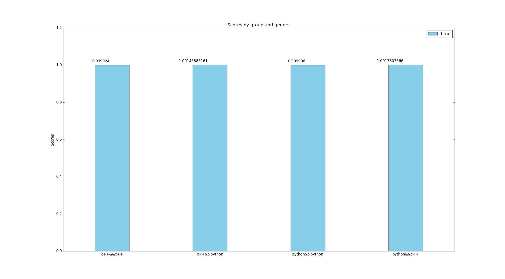
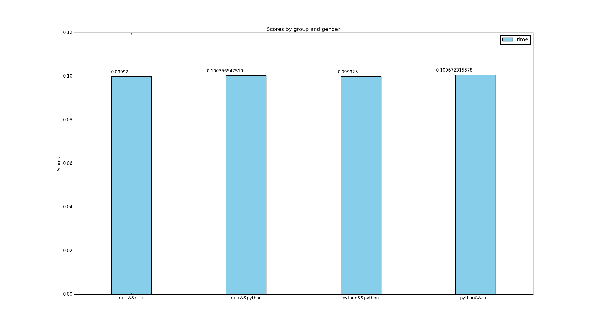
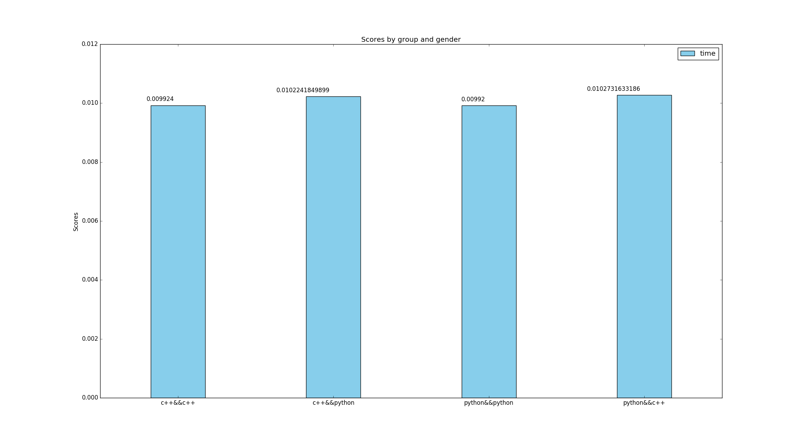

# Performance test
performance_tests” with 4 files containing a
node each. You will have to implement: (1) One simple publisher written in C++, (2) One
simple publisher written in Python, (3) One simple subscriber written in C++ and (4) One
simple subscriber written in Python

**Author: Agustin Ortega aortega@gmail.com**

## Overview
this code creates differents combinations of subscribers and publishers in c++ and python

## Building and installing

    cd catkin_workspace/src
    git clone https://github.com/agusorte/performance_test

    cd ../
    catkin_make

## Dependences
- ros kinect
- python 2.7
- catkin

## Running
    roslaunch performance_test c++_node_to_c++_node.launch
    roslaunch performance_test c++_node_to_python_node.launch
    roslaunch performance_test python_node_to_python_node.launch
    roslaunch performance_test python_node_to_c++_node.launch

## Setting

We can change the framerate in setting modifying the files launche/file.launch
     
     
       <node pkg="performance_test" type="publisherRos_node" name="publisherRos_node" args="1" output="screen"/>

       <node pkg="performance_test" type="pypublisher.py" name="pypublisher" output="screen" >
       <param name="rate" value="1"/>
       </node>

## Nodes

### c++
- publisherRos_node.
- subscriberRos_node.
### python
- pypublisher.py
- pysubscriber.py

### plotting results
     python src/plot_results.py

## Results
these results are for 100 loops with 1, 100 and 100 hz of frecuency

